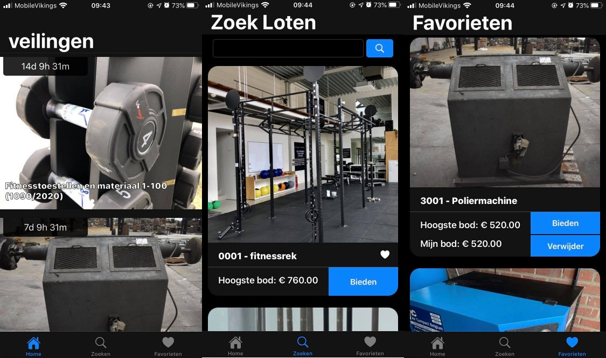

# AuctionApp

This is my project for the course of Native Apps II. This project is a mockup for an auction application. 
The application retrieves auctions and lots from a custom API and allows a user to bid on them.

For the scope of this project no user management was implemented. This means that when a user bids, the lot and bid he performed will be saved locally on a Realm database but no further actions are possible. 
The bid will be posted to the service and persisted so that other users can see the current highest bid, but no user information of the bid will be saved.

# Usage

The app should just run using the xcode project.

# Used service

For this application an API was written using .net core with a PostgreSQL database implementation.
More information about the service can be found @ https://github.com/Cloet/veilingservice

 # Screenshots
 Some screenshot, taken on a iPhone 7 with dark mode on.
 
 
